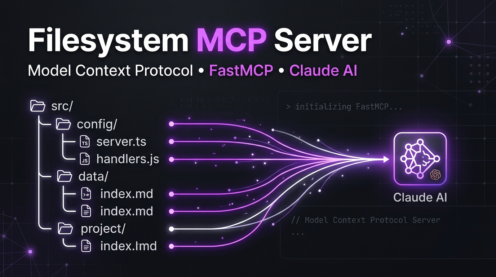
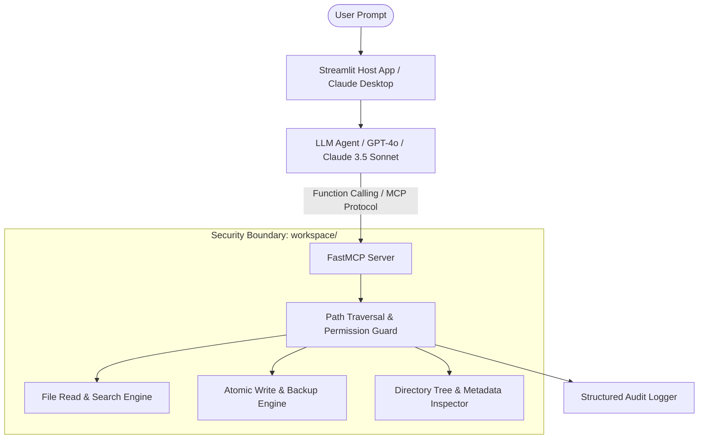

# ⚡ FastMCP Filesystem Server & AI Assistant

[](https://codespaces.new/Bosaj/filesystem-mcp-with-FastMCP-server) [](https://github.com/Bosaj/filesystem-mcp-with-FastMCP-server/releases) [](CODE_OF_CONDUCT.md)


<p align="center">
  
</p>

<div align="center">

[](https://github.com/Bosaj/filesystem-mcp-with-FastMCP-server/actions)
[](https://github.com/Bosaj/filesystem-mcp-with-FastMCP-server/wiki)
[](docs/MONITORING_AND_QA.md)
[](LICENSE)
[](requirements.txt)
[](server/filesystem_mcp_server.py)

**A high-performance, sandboxed filesystem manager built on the Model Context Protocol (MCP) with FastMCP, featuring a reactive Streamlit UI and OpenAI function calling.**

[Features](#-features) • [Claude Desktop Setup](#-connect-to-claude-desktop-in-10s) • [Architecture](#-architecture) • [Tools](#-8-available-mcp-tools) • [Quickstart](#-quickstart)

</div>

---

## 🎯 What is This?

An enterprise-ready AI file manager built with **Anthropic's Model Context Protocol (MCP)** and **FastMCP**. It bridges LLM reasoning directly to local filesystem operations inside a hardened, sandboxed workspace with complete path-traversal prevention.

* 🤖 **Autonomous AI Tool Calling**: OpenAI GPT-4o function-calling automatically selects the optimal file tools based on natural language prompts.
* 🔒 **Sandboxed File Operations**: Strict path validation prevents any access outside the designated `workspace/` boundary.
* 🎨 **Full-Stack Web Interface**: Modern 3-tab Streamlit dashboard (Agent Chat, Live File Tree Explorer, Direct Quick-Action Tools).
* ⚡ **Production FastMCP Engine**: SSE (Server-Sent Events) and stdio transport with asynchronous I/O and zero memory leaks.

---

## 🔌 Connect to Claude Desktop (in 10s)

You can connect this MCP server directly to **Anthropic Claude Desktop** so Claude can inspect, create, read, and organize your files locally.

Add the following to your `claude_desktop_config.json`:

* **Windows**: `%APPDATA%\Claude\claude_desktop_config.json`
* **macOS**: `~/Library/Application Support/Claude/claude_desktop_config.json`

```json
{
  "mcpServers": {
    "filesystem-fastmcp": {
      "command": "python",
      "args": [
        "-m",
        "server.filesystem_mcp_server"
      ],
      "cwd": "C:/path/to/filesystem-mcp-with-FastMCP-server"
    }
  }
}
```

Restart Claude Desktop, and you will see the hammer icon 🔨 with all 8 filesystem tools ready to use!

---

## 🏗️ Architecture



---

## 🛠️ 8 Available MCP Tools

| Tool | Parameters | Description |
|---|---|---|
| `list_directory` | `path: str = ""` | Lists all files and folders in the specified directory with sizes. |
| `read_file` | `filepath: str, max_bytes: int = 1048576` | Reads text content safely with size limits. |
| `write_file` | `filepath: str, content: str` | Creates or atomically overwrites a file. |
| `delete_file` | `filepath: str` | Safely removes a file inside the sandbox. |
| `get_file_info` | `filepath: str` | Returns metadata (size, created, modified, permissions). |
| `create_directory` | `path: str` | Creates nested directory trees inside `workspace/`. |
| `search_files` | `pattern: str, recursive: bool = True` | Wildcard and regex file search across directories. |
| `copy_file` | `source: str, destination: str` | Duplicates files with metadata preservation. |

---

## 🚀 Quickstart

### 1. Clone & Setup Environment
```bash
git clone https://github.com/Bosaj/filesystem-mcp-with-FastMCP-server.git
cd filesystem-mcp-with-FastMCP-server

python -m venv .venv
# Windows:
.venv\Scripts\activate
# Linux/macOS:
source .venv/bin/activate

pip install -r requirements.txt
```

### 2. Configure Environment Variables
```bash
cp .env.example .env
# Edit .env and set your OPENAI_API_KEY
```

### 3. Run the Standalone FastMCP Server
```bash
python -m server.filesystem_mcp_server
```

### 4. Run the Streamlit Interactive Web Interface
```bash
streamlit run host/app.py
```

---

## 🧪 Testing & Verification

Run the automated test suite and lint checks:
```bash
pytest tests/ -v --cov=server --cov-report=term-missing
flake8 server/ host/
black --check server/ host/
```

---

## 👥 Contributors & Authors

* **[Oussama EL HADJI (@Bosaj)](https://github.com/Bosaj)** — Core Architecture, FastMCP server implementation, and CI/CD pipelines.
* **[chakorabdellatif](https://github.com/chakorabdellatif)** — Collaborative development and testing.
* **[yassinebenacha](https://github.com/yassinebenacha)** — Frontend dashboard review.

---

## 📄 License
This project is licensed under the [MIT License](LICENSE).
